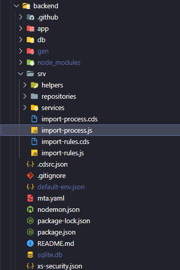
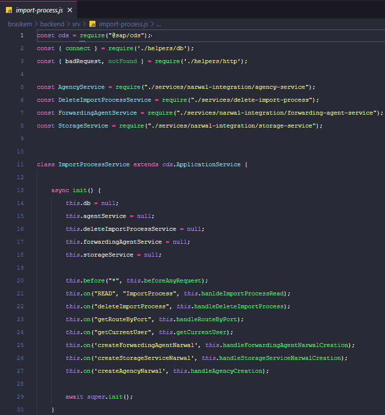
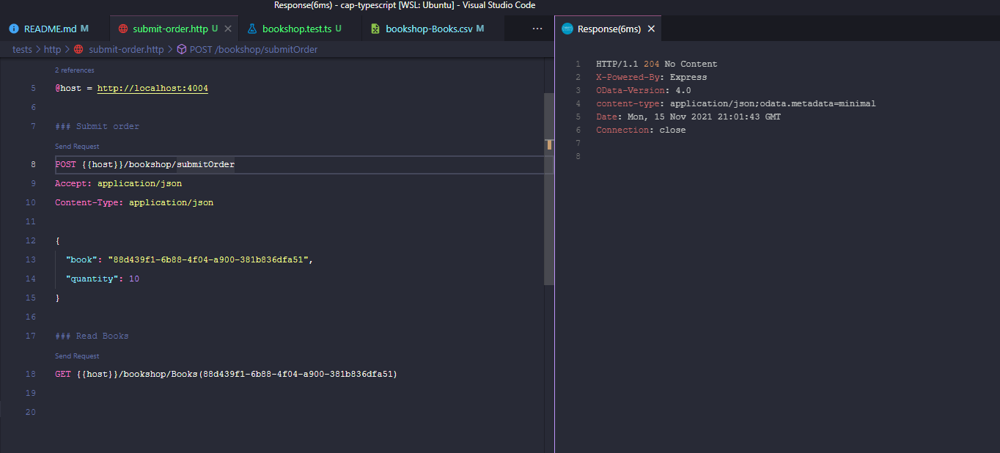
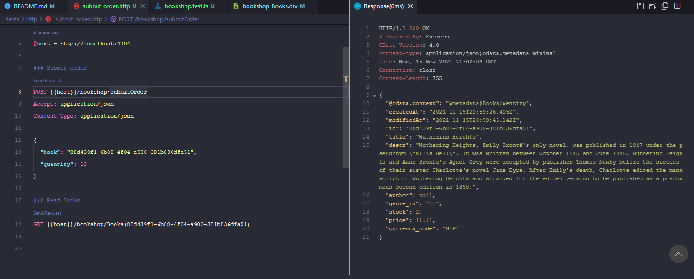

In today's post we'll show you how we work here at VAAES.

Many of you have never heard or don't know which development tools SAP makes available to us for application development, so I decided to bring a little bit about the Cloud Application Programming Model or just CAP today.

CAP is a tool we use to develop API's in a simple and practical way. It is not only available in Java, but also from NodeJs and we all know how NodeJs is very common in cloud development. Working with Javascript in the backend is great, but as projects get bigger, weakly typing of Javascript can be challenging. So Typescript comes into play to provide us with more robust typing. And I confess that I'm a fan of this technology.

Here we can see the folder structure of a normal CAP project. Note that the `.cds` and `.js` files are mixed inside the srv folder. Unfortunately we can't move them to different folders because CAP wouldn't recognize them.



## Project structure

Furthermore, the `handlers` files in Javascript ended up doing all the logic in one place. From fetching the data from the database, business rules, etc. And that's not so cool for code maintenance. As we can see in the example below:




## Code

No more stalling, let's get down to business. We are going to create the famous `bookshop` example proposed by SAP.

>Note: This tutorial was made with NodeJs v14.17.6 and @sap/cds 5.4.3


First, let's create a folder for our new project:


Now, let's globally install the CAP command line library:

```bash
npm i -g @sap/cds-dk hana-cli
```


Once that's done, let's create the skeleton of the project:
```bash
cds init
```


Now, let's create the db module. This command will create the files necessary for the db module to run correctly:
```bash
hana-cli createModule
```


With the db module ready, let's create our cds file inside the db module where we will create the entities of our library later:
```bash
mkdir db/cds && cd "$_" && touch bookshop.cds
```

Now, let's fill the `bookshop.cds` file with the entities:
```typescript
using {
    Currency,
    managed,
    sap
} from '@sap/cds/common';

namespace bookshop;

entity Books: managed {
    key id: UUID;
        title: localized String(111);
        descr: localized String(1111);
        author: Association to Authors;
        genre: Association to Genres;
        stock: Integer;
        price: Decimal;
        currency: Currency;
        image: LargeBinary @Core.MediaType: 'image/png';
}

entity Authors: managed {
    key id: UUID;
        name: String(111);
        dateOfBirth: Date;
        dateOfDeath: Date;
        placeOfBirth: String;
        placeOfDeath: String;
        books: Association to many Books on books.author = $self;
}

entity Genres: sap.common.CodeList {
    key id: UUID;
        parent: Association to Genres;
        children: Composition of many Genres on children.parent = $self;
}
```

>Note: To learn more about cds files, visit this [page](https://cap.cloud.sap/docs/)

Let's create the service to expose our entities:
```bash
 cd ../../srv/ && touch bookshop.cds
```

Fill in the content of the created file with:
```typescript
using {bookshop} from '../db/cds/bookshop';

service BookshopService {
    @readonly
    entity ListOfBooks as projection on Books excluding {
        descr
    };

    @readonly
    entity Books as projection on bookshop.Books {
        * ,
        author.name as author
    } excluding {
        createdBy,
        modifiedBy
    };
}
```

Running the service:
```bash
cd .. && cds run
```


Our service was exposed on port 404 (default):


However, when we try to access some of the exposed entities, notice that an error will occur. This is because we haven't installed the database to run our application yet.


Now that we have our modeling and service ready, let's add some dependencies so we can run our application correctly:

```bash
# Production dependencies
npm i @sap/cds @sap/hana-client @sap/xsenv @sap/xssec cds-routing-handlers express npm-run-all passport reflect-metadata module-alias

# Dev dependencies
npm i -D @types/express @typescript-eslint/eslint-plugin @typescript-eslint/parser cds2types eslint eslint-config-google eslint-plugin-prettier git-commit-msg-linter jest nodemon prettier sqlite3 supertest typescript @types/jest ts-jest
```

Explaning dependencies:
```bash
1) @sap/cds - command line tool so anyone can run the project without having to install cds globally
2) @sap/hana-client - library used to connect to the SAP Hana database (used only in a productive environment)
3) @sap/xsenv - used to fetch environment variables inside the deployed container in Cloud Foundry (Cloud platform from SAP)
4) @sap/xssec e passport - Responsible for application security
5) cds-routing-handlers e express - Framework to expose our API and redirect our custom handlers wherever we want
6) reflect-metadata - Used for various purposes, but in our project it will be used to output data from decorators
7) module-alias - As we will use typescript, this module allows us to register shortcuts to access folders inside our typescript code. Also, transpilation allows the code to continue working in javascript.
```

After installing the dependencies, let's create two more folders at the root of the project:

```
mkdir src && mkdir scripts
```

Let's add some files responsible for configuring our development environment:

.cdsrc.json
```JSON
{
    "build": {
        "target": "gen"
    },
    "hana": {
        "deploy-format": "hdbtable"
    },
    "[production]": {
        "requires": {
            "db": {
                "kind": "hana"
            },
            "uaa": {
                "kind": "xsuaa"
            }
        }
    },
    "requires": {
        "db": {
            "kind": "sqlite"
        }
    }
}
```

.eslintignore
```JSON
gen/
node_modules/
coverage/
**/*.cds
```

.eslintrc.json
```JSON
{
    "env": {
        "browser": true,
        "commonjs": true,
        "es6": true
    },
    "parser": "@typescript-eslint/parser",
    "plugins": [
        "@typescript-eslint",
        "prettier"
    ],
    "extends": [
        "google"
    ],
    "globals": {
        "Atomics": "readonly",
        "SharedArrayBuffer": "readonly"
    },
    "parserOptions": {
        "ecmaVersion": 2020
    },
    "rules": {
        "prettier/prettier": [ "error", { "endOfLine": "auto" } ],
        "@typescript-eslint/no-unused-vars": ["error", { "caughtErrors": "all", "caughtErrorsIgnorePattern": "^ignore", "ignoreRestSiblings": true }],
        "arrow-parens": "off",
        "camelcase": "off",
        "comma-dangle": "off",
        "indent": ["error", 4, { "SwitchCase": 1 }],
        "linebreak-style": "off",
        "max-len": ["error", 120],
        "max-lines-per-function": ["warn", 30],
        "new-cap": "off",
        "no-tabs": ["error"],
        "object-curly-spacing": ["error", "always"],
        "operator-linebreak": "off",
        "prefer-rest-params": "off",
        "quote-props": ["error", "as-needed"],
        "require-jsdoc": "off",
        "space-before-function-paren": "off",
        "valid-jsdoc": "off"
    }
}
```

.gitignore
```bash
gen/
sqlite.db
coverage
*.lcov
node_modules/
```

.prettierignore
```bash
**/*.cds
```

.prettierrc.json
```JSON
{
    "trailingComma": "es5",
    "tabWidth": 4,
    "semicolons": true,
    "ternaries": false,
    "printWidth": 120,
    "singleQuote": true
}
```

nodemon.json
```JSON
{
    "watch": ["src/**/*", "srv/**/*"],
    "ignore": "./src/entities/",
    "ext": "csv,cds,ts",
    "exec": "npm run build:local && node ./gen/srv/srv/server.js",
    "env": {
        "PORT": 4004,
        "NODE_ENV": "development"
    }
}
```

tsconfig.json
```JSON
{
    "compilerOptions": {
        "lib": ["ES2019"],
        "module": "commonjs",
        "target": "ES2019",
        "esModuleInterop": true,
        "inlineSourceMap": true,
        "inlineSources": true,
        "outDir": "./gen/srv/srv",
        "emitDecoratorMetadata": true,
        "experimentalDecorators": true,
        "preserveConstEnums": true,
        "skipLibCheck": true,
        "baseUrl": ".",
        "paths": {
            "@/*": ["src/*"]
        }
    },
    "include": ["src"],
    "exclude": ["node_modules"]
}
```

jest-integration.config.js
```javascript
const config = require('./jest.config');
config.testMatch = ['**/*.test.ts'];
module.exports = config;
```

jest-unit.config.js
```javascript
const config = require('./jest.config');
config.testMatch = ['**/*.spec.js'];
module.exports = config;
```

jest.config.js
```javascript
const { pathsToModuleNameMapper } = require('ts-jest/utils');
const { paths } = require('./tsconfig').compilerOptions;

module.exports = {
    globals: {
        'ts-jest': {
            diagnostics: false,
        },
    },
    roots: ['<rootDir>/tests', '<rootDir>/srv'],
    collectCoverageFrom: ['<rootDir>/srv/**/*.js'],
    coverageDirectory: 'coverage',
    coverageProvider: 'babel',
    testEnvironment: 'node',
    transform: {
        '.+\\.ts$': 'ts-jest',
    },
    moduleNameMapper: {
        ...pathsToModuleNameMapper(paths, { prefix: '<rootDir>' }),
    },
};
```

Now, let's create the scripts in our package.json:
```JSON
"scripts": {
    "start": "CDS_ENV=production NODE_ENV=production cds run",
    "dev": "nodemon",
    "build": "mbt build",
    "build:local": "npm-run-all build:db-local build:cds build:ts",
    "build:cds": "node ./scripts/convert-entities-to-ts",
    "build:ts": "tsc",
    "build:db-local": "cds deploy --to sqlite:sqlite.db --no-save --with-mocks",
    "eslint:ci": "eslint --fix src",
    "test": "jest --passWithNoTests --silent --runInBand",
    "test:unit": "npm test -- --watchAll -c jest-unit.config.js",
    "test:integration": "npm test -- --watchAll -c jest-integration.config.js",
    "test:staged": "npm test -- --findRelatedTests",
    "test:ci": "npm test -- --coverage"
}
```

Now that we've created the scripts in package.json, let's create a script to convert the entities from cds to ts. This script is necessary because the `cds2types` library has some limitations and one of them is not being able to convert custom `actions` and `functions`
```bash
cd scripts && touch convert-entities-to-ts.js
```

And let's put the logic to run the cds to typescript converting lib:
```javascript
const { readdirSync, existsSync, mkdirSync } = require('fs');
const { resolve } = require('path');
const { execSync } = require('child_process');

const files = readdirSync(resolve(__dirname, '..', 'srv')).filter((file) => file.includes('.cds'));

if (!existsSync(resolve(__dirname, '..', 'src', 'entities'))) {
    mkdirSync(resolve(__dirname, '..', 'src', 'entities'));
}

for (const file of files) {
    const srvPath = resolve(__dirname, '..', 'srv');
    const srcPath = resolve(__dirname, '..', 'src');
    const cdsToConvert = `--cds ${srvPath}/${file}`;
    const fileWithoutExtension = file.split('.')[0];
    const outputFile = `--output ${srcPath}/entities/${fileWithoutExtension}.ts`;
    execSync(`npx cds2types ${cdsToConvert} ${outputFile} -f`);
}

execSync('cds build && cp .cdsrc.json gen/srv');
```

Now let's create our first custom handler. This example handler will change the title of each book before showing it to the end user.

I like to separate into services when the logic will be applied directly to the main service and handlers when working with actions and functions. We'll look at an example in a moment.

```bash
mkdir src/services && cd "$_" && touch bookshop.ts
```

And add the content of the service:
```typescript
import { Handler, AfterRead, Entities } from 'cds-routing-handlers';
import { BookshopService } from '@/entities/bookshop';

@Handler(BookshopService.SanitizedEntity.Books)
export class BookService {
    @AfterRead()
    public async addDiscount(@Entities() books: BookshopService.Books[]): Promise<void> {
        books = !Array.isArray(books) ? [books] : books;
        for (const book of books) {
            if (book.stock > 111) {
                book.title += ` -- 11% discount!`;
            }
        }
    }
}
```

Note that the typescript will complain with the import of our service, as it is pointing to a folder that does not exist. For this we need to do two things

Create a config file to accept `@` as a valid path mapping:
```bash
mkdir src/config && cd "$_" && touch module-alias.ts
```

```typescript
import { join } from 'path';
import moduleAlias from 'module-alias';

moduleAlias.addAlias('@', join(__dirname, '..'));
```

And we need to run the script we just created in our package.json:
```bash
npm run build:local
```

This script will create for us the entities folder and inside it will be created the entities that we exposed previously in the cds files.

Now, we just need to create the server so that we can point these services and custom handlers to our typescript code.

```bash
cd src && touch server.ts && touch app.ts
```

app.ts
```typescript
import 'reflect-metadata';
import './config/module-alias';
import express from 'express';
import { createCombinedHandler } from 'cds-routing-handlers';
import cds from '@sap/cds';

export const application = async () => {
    const app = express();

    const hdl = createCombinedHandler({
        handler: [__dirname + '/services/**/*.js', __dirname + '/handlers/**/*.js'],
    });

    await cds.connect('db');
    await cds
        .serve('all')
        .in(app)
        .with((srv) => hdl(srv));

    return app;
};
```

server.ts
```typescript
import { application } from './app';

export class Server {
    public static async run() {
        const app = await application();
        const port = process.env.PORT || 3001;
        app.listen(port, async () => {
            console.info(`Server is listing at http://localhost:${port}`);
        });
    }
}

Server.run();
```

All done!
Our API can already be consumed with custom handlers and services written in typescript!


You can feed this database by creating csv files inside the db/data folder. You can find an example [here](https://github.com/mlucascardoso/cap-typescript/tree/main/db/data)

After loading the database, start the API with the command `npm run dev` and access [localhost](http://localhost:4004/bookshop/Books)

Our custom logic is already working


## Custom action

Now that we've seen how to create a custom service, let's see what a custom action would look like

```bash
mkdir -p src/handlers/actions && cd "$_" && touch submit-order.ts
```

Let's edit our bookshop cds file inside `srv`

srv/bookshop.cds
```typescript
    action submitOrder(book: Books:id, quantity: Integer) returns {
        stock: Integer
    };
```

src/handlers/actions/submit-order.ts
```typescript
import cds from '@sap/cds';
import { Action, Handler, Param, Req } from 'cds-routing-handlers';
import { BookshopService, bookshop } from '@/entities/bookshop';
import { Request } from '@sap/cds/apis/services';

@Handler()
export class SubmitOrderHandler {
    @Action(BookshopService.ActionSubmitOrder.name)
    public async handle(
        @Param(BookshopService.ActionSubmitOrder.paramBook) bookId: bookshop.Books['id'],
        @Param(BookshopService.ActionSubmitOrder.paramQuantity) quantity: number,
        @Req() req: Request
    ): Promise<any> {
        if (!bookId || !quantity) {
            return req.reject(400, 'Please, provide all mandatory fields');
        }

        const affectedRows = await cds
            .update(BookshopService.Entity.Books)
            .with({ stock: { '-=': quantity } })
            .where({ id: bookId, stock: { '>=': quantity } });

        if (affectedRows < 0) {
            return req.reject(409, `${quantity} exceeds stock for book ${bookId}`);
        }
    }
}
```

Notice how the code is very isolated and easy to understand. Lets test!

```bash
mkdir tests/http && cd "$_" && touch submit-order.http
```

```http
### Requires REST Client for VS Code
### https://marketplace.visualstudio.com/items?itemName=humao.rest-client
###

@host = http://localhost:4004

### Submit order
POST {{host}}/bookshop/submitOrder
Accept: application/json
Content-Type: application/json

{ 
  "book": "88d439f1-6b88-4f04-a900-381b836dfa51",
  "quantity": 10 
}

### Read Books
GET {{host}}/bookshop/Books(88d439f1-6b88-4f04-a900-381b836dfa51)
```





## Testing

To implement the tests of our application, we have already configured jest in advance. It's a very famous and easy-to-understand testing framework.

Let's create an example test that will consume our real API and make sure it's all right:
```bash
mkdir tests/integration && cd "$_" && touch bookshop.test.ts
```

bookshop.test.ts
```typescript
import supertest from 'supertest';
import { application } from '../../src/app';

let app = null;

describe('Books', () => {
    beforeAll(async () => {
        app = await application();
    });

    it('should return 200 if books were listed correctly', async () => {
        const api = supertest(app) as any;
        const response = await api.get('/bookshop/Books');
        expect(response.statusCode).toEqual(200);
    });

    afterEach((done) => {
        done();
    });
});
```

Remember that we configured app.ts separately from the server? That configuration was on purpose, as we were able to use the same configuration for our tests :)

Running the tests
```bash
npm run test:integration
```

If you create unit tests, it's also possible. Just create the file with the following pattern `<filename>.unit.ts` and run the tests with `npm run test:unit`